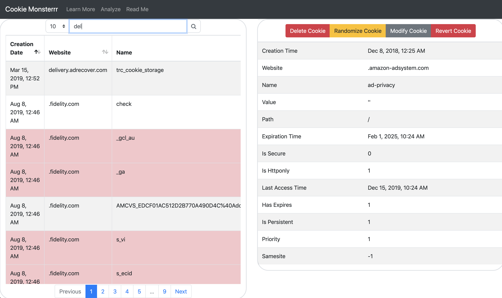
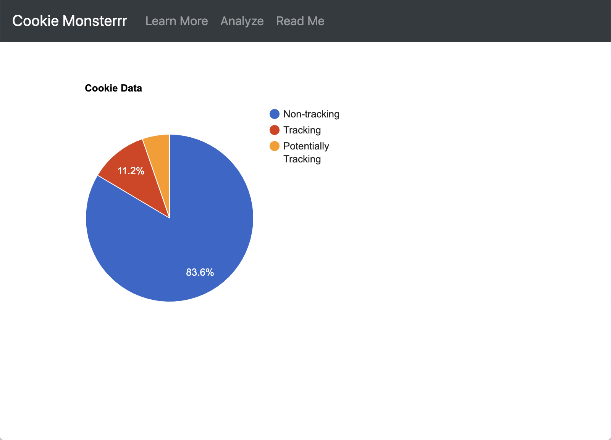

# Cookie Monsterrrr

## Description
Cookie Monster is a user-friendly tool that allows you to view, edit, and delete your cookies. Have you ever wondered where most of your cookies come from, what information they hold, or even, if a cookie tracking you? Cookie Monsterrr will help you find out just that and more with a click of a button. Learn to View, Edit, and Delete your cookies with __Cookie Monster__!!

## Installation for Mac
1. Clone the repo
2. Run ```npm install```
3. Run ```node .\createDB.js```
4. Run ```npm rebuild```
5. Run ```.\node_modules\.bin\electron-rebuild```
6. Navigate to cloned directory and Run ```npm start```

## Use
Cookie Monsterrr allows you to view, modify, and delete your cookies. Cookies marked in red are tracking your information.

* The **Modify Cookie** option allows you to personalize what information you want the cookie's host to receve.
* The **Randomize Cookie** option scrambles what information the cookie's host previously had on you.
* The **Delete Cookie** option removes it from the table, as well as on your system.
* The **Revert Cookie** option changes all information to previous values



#### Analyze
* A breakdown of your non-tracking vs. tracking cookies is shown in the Analyze tab 



#### Learn more
* More information about the details of the specific cookies are found on the learn more tab


 

## Cookies

### Cookie Format
Chrome stores cookies in a local sqlite3 table with the following setup.
```
CREATE TABLE cookies(
    creation_utc INTEGER NOT NULL,
    host_key TEXT NOT NULL,
    name TEXT NOT NULL,
    value TEXT NOT NULL,
    path TEXT NOT NULL,
    expires_utc INTEGER NOT NULL,
    is_secure INTEGER NOT NULL,
    is_httponly INTEGER NOT NULL,
    last_access_utc INTEGER NOT NULL,
    has_expires INTEGER NOT NULL DEFAULT 1,
    is_persistent INTEGER NOT NULL DEFAULT 1,
    priority INTEGER NOT NULL DEFAULT 1,
    encrypted_value BLOB DEFAULT '',
    samesite INTEGER NOT NULL DEFAULT -1,

    UNIQUE (host_key, name, path)
);
```
**Example Cookie:**
```
{
    creation_utc: 13198689890368478,
    host_key: '.fandango.com',
    name: 'zip',
    value: '',
    path: '/',
    expires_utc: 13230225890000000,
    is_secure: 1,
    is_httponly: 0,
    last_access_utc: 13198690365647604,
    has_expires: 1,
    is_persistent: 1,
    priority: 1,
    encrypted_value: <Buffer 76 31 30 68 53 3e d1 61 10 31 d2 92 8f 3c 04 93 d8 eb 52>,
    samesite: -1
}
```

### Cookie Database Interface
**Example:**
```
// Retrieve a cookie from the db

// Cookies are keyed in the database using a combination of host_key, name, and path.
// Each of these values on their own do not have to be unique, however they must
// be in combination.
var desiredCookie = {
    host_key: '.fandango.com',
    name: 'zip',
    path: '/'
}

// ChromeDB is a static class
var retrievedCookie = ChromeDB.getCookie(desiredCookie);

// retrievedCookie now holds an entire cookie object, with all properties
// shown above. To modify one of the values, it's as simple as this:
retrievedCookie.creation_utc = 12345;

// Storing this change back into the db:
var rv = ChromeDB.modifyCookie(retrievedCookie);

// NOTE: You cannot modify the host_key, name, or path using this function.
// To do that, run this:
rv = ChromeDB.deleteCookie(retrievedCookie);
retrievedCookie.name = 'zap';
rv = ChromeDB.addCookie(retrievedCookie);

// Another NOTE: Do not attempt to modify the encrypted_value property.
// this is automatically taken care of in the interface.
// Simply edit the value property.
```
## Team Members:
-  Ktailor34
-  abhi-ravi
-  phicks6
-  isikkema
